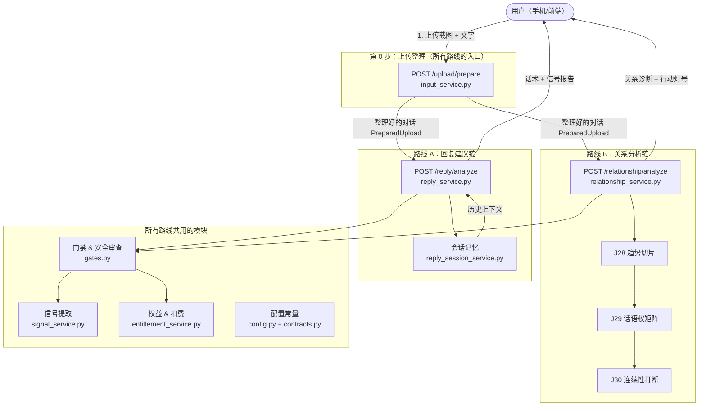
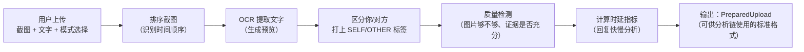
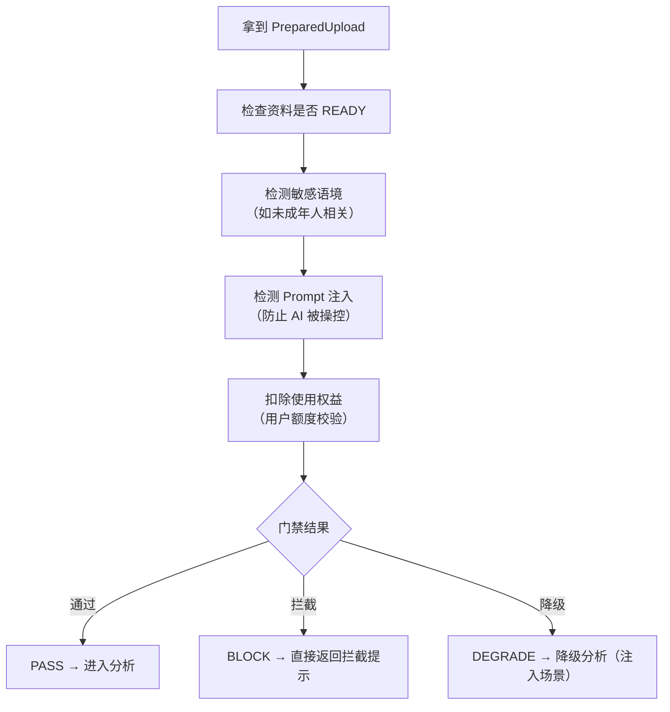
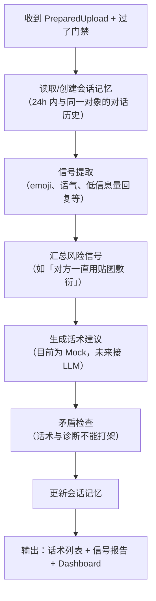
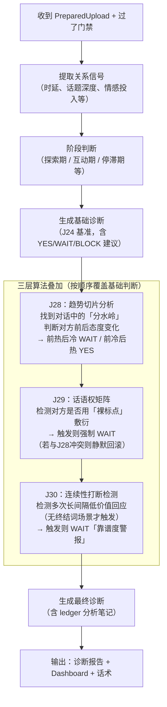
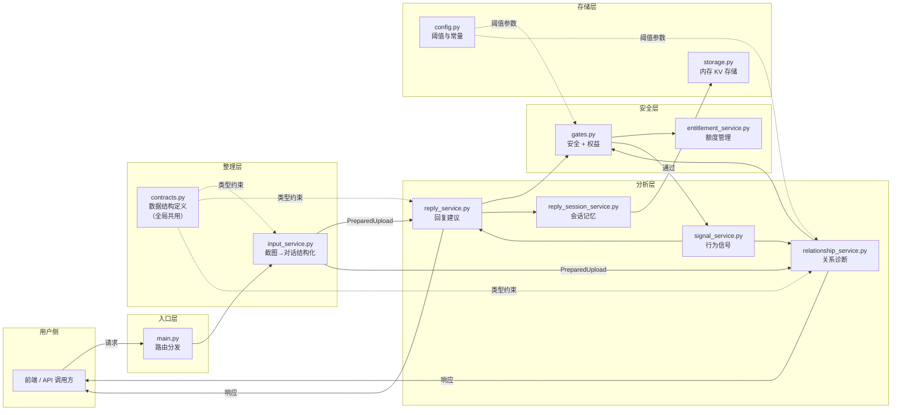

# JoyPilot 运行路径图

> 零基础友好版：以「用户视角」说明每一步系统在做什么，以及各模块如何串联。

---

## 一、JoyPilot 是什么（一句话）

用户把聊天截图上传给 JoyPilot，系统帮你分析对方的态度、给出回复建议或关系诊断报告。

---

## 二、用户的两条主路线

```
你上传截图
     │
     ▼
【路线 A】想要「怎么回复」  →  /reply/analyze    → 话术建议 + 信号分析
【路线 B】想要「关系怎样了」→  /relationship/analyze → 关系诊断 + 行动建议
```

两条路线都**必须先经过"上传整理"这一步**，再分别进入自己的分析链。

---

## 三、整体架构总图



---

## 四、第 0 步：上传整理（`input_service.py`）

> **你做什么**：把截图（或文字）上传，告诉系统哪边是你、哪边是对方。  
> **系统做什么**：把截图变成结构化的「对话记录」，检查截图质量是否够用。



**输出字段一览（用人话说）：**

| 字段 | 含义 |
|------|------|
| `status` | 资料 READY（可继续）/ NEEDS_REVIEW（有问题） |
| `dialogue_turns` | 逐条对话记录，每条含说话方、文字、时间戳 |
| `issues` | 当前资料的问题清单（如截图不够清晰） |
| `evidence_quality` | 证据充分度评级（HIGH / MEDIUM / LOW / INSUFFICIENT） |

---

## 五、共用安全闸门（`gates.py`）

> 每条路线在正式分析前，都要先过这道关卡。  
> 保护你不被用来做违规用途，也保护系统不被注入恶意内容。



---

## 六、路线 A：回复建议链（`reply_service.py`）

> **你想要**：「现在该怎么回对方？」  
> **系统给你**：推荐话术 + 行为信号分析 + 风险提示



**输出字段一览：**

| 字段 | 含义 |
|------|------|
| `message_bank` | 可直接发送的话术列表 |
| `action_light` | 行动灯号（GREEN 发 / YELLOW 谨慎 / RED 暂停） |
| `signals` | 对方行为信号列表（如低情感投入） |
| `risk_summary` | 风险摘要（一句话） |

---

## 七、路线 B：关系分析链（`relationship_service.py`）

> **你想要**：「我们现在关系处于什么阶段？对方是什么态度？」  
> **系统给你**：关系诊断 + 行动建议 + 三层算法叠加分析



**三层算法说明（用人话）：**

| 算法 | 检测什么 | 触发条件 | 结果 |
|------|---------|---------|------|
| **J28** | 对话前后态度反转 | 找到「晚安/去忙」等分水岭词 | 前热后冷→等待 / 前冷后热→发探针 |
| **J29** | 对方用纯标点敷衍 | `。` `？？？` 等裸标点 | 强制等待，追加「投资失衡」提示 |
| **J30** | 对方多次消失后敷衍回 | ≥2 次间隔 >3h + 低价值回复 | 等待，追加「靠谱度警报」 |

**J28 / J29 冲突处理（静默回滚）：**

```
J28 说「前冷后热，可以发消息」
+
J29 说「但 Part_B 里有裸标点」
= 双信号矛盾 → 悄悄回滚到基础判断（不追加任何 J28/J29 注释）
```

**输出字段一览：**

| 字段 | 含义 |
|------|------|
| `send_recommendation` | YES（发）/ WAIT（等）/ BLOCK（停）|
| `action_light` | 行动灯号（颜色） |
| `ledger.note` | 诊断笔记（含趋势警报等原因） |
| `stage_transition` | 当前阶段标签（如 observe / advance） |
| `message_bank` | 推荐话术（WAIT/BLOCK 时可能为空） |

---

## 八、数据在模块间的完整流转图



---

## 九、一次完整的「关系分析」请求全链路（文字版）

1. **你**：上传 10 张聊天截图，选择「关系模式」，填入你的 user_id
2. **`main.py`**：接收请求，转发给 `input_service.prepare_upload`
3. **`input_service`**：排序截图 → OCR → 切分 SELF/OTHER → 计算时延 → 输出 `PreparedUpload`
4. **`main.py`**：把 `PreparedUpload` 带入 `relationship_service.analyze_relationship`
5. **`gates.py`**：先查安全 → 再扣额度；若 BLOCK 直接返回拦截，否则继续
6. **`signal_service`**：扫描 emoji、低信息量回复、注入风险等
7. **`relationship_service`**（基础链）：判断阶段、生成基础建议（J24）
8. **J28**：找「晚安」等分水岭 → 切 Part A/B → 前后对比 → 可能覆盖建议
9. **J29**：扫描当前活跃窗口内的裸标点 → 可能强制 WAIT，或与 J28 冲突则回滚
10. **J30**（仅无分水岭时）：检测多次消失 + 敷衍 → 可能追加靠谱度警报
11. **`relationship_service`**：整合所有覆盖结果，写 `ledger.note`，生成 Dashboard
12. **你**：收到 `send_recommendation`（YES/WAIT/BLOCK）、行动灯号、诊断笔记、推荐话术

---

## 十、模块职责速查表

| 模块 | 文件 | 职责（一句话） |
|------|------|----------------|
| 路由入口 | `main.py` | 接收 HTTP 请求，分发到对应 service |
| 数据契约 | `contracts.py` | 定义所有输入/输出的数据结构，全局共用 |
| 输入整理 | `input_service.py` | 把截图/文字变成标准化对话记录 |
| 安全门禁 | `gates.py` | 过滤违规内容、扣除额度、阻断注入 |
| 回复建议 | `reply_service.py` | 生成「怎么回」的话术与信号分析 |
| 关系分析 | `relationship_service.py` | 诊断关系阶段与对方态度，含 J28/J29/J30 |
| 信号提取 | `signal_service.py` | 从文本中识别 emoji/低信量等行为信号 |
| 会话记忆 | `reply_session_service.py` | 记住 24h 内与同一对象的对话上下文 |
| 权益管理 | `entitlement_service.py` | 管理用户使用额度，防止超限 |
| 配置常量 | `config.py` | 统一管理所有阈值和词库（如 J30 的 3h 时间门） |
| 存储 | `storage.py` | 内存键值对，存会话状态等临时数据 |
