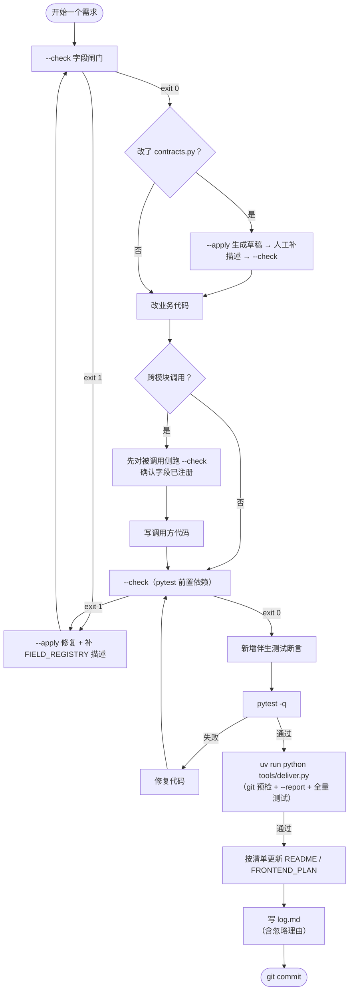

# JoyPilot 端到端开发工作流（模块视角）

本文是**操作手册（How-to）**，说明从需求到交付的固定顺序，以及与 module-0～9 和治理脚本的对应关系。  
**强制约束与阻断规则**（AI 行为约束、exit 码处理）以 [`.cursor/rules/field-registry-sync.mdc`](.cursor/rules/field-registry-sync.mdc) 为准；其中 **§4b 模块交付收尾** 要求 Cursor AI 在宣称「模块完成」前必须跑 `deliver.py`（或等效链）并按报告更新文档。  
命令一律使用 `uv run python ...`（见 [`docs_control_center/FIELD_SYNC_UV_RUN.md`](FIELD_SYNC_UV_RUN.md)）。

### AI 模块收尾（与 .mdc §4b 对齐）

| 步骤 | 做什么 |
|------|--------|
| 1 | 项目根：`uv run python tools/deliver.py` |
| 2 | 若因工作区干净失败：对本轮改动路径跑 `implement_doc_report.py --files ...`，再 `--check` + `pytest` |
| 3 | 若非 git：仍跑 `--check`、`--report --with-code`、`implement_doc_report --files <路径>`、`pytest` |
| 4 | 按终端报告更新 README / FRONTEND_PLAN / FIELD_REGISTRY / `log.md`（忽略文档项须附理由） |
| 5 | **未做完上表不得对用户说「任务已完成」** |

---

## 一、模块地图（README 分区 = 能力域）

| 编号 | 名称 | 主要代码 / 落点 |
|------|------|------------------|
| **module-0** | 骨架与唯一真相源 | `app/contracts.py`、`config.py`、`storage.py` |
| **module-1** | 输入整理 | `app/input_service.py`，`POST /upload/prepare` |
| **module-2** | 门禁与安全 | `app/gates.py` |
| **module-3** | 回话 Session | `app/reply_session_service.py` |
| **module-4** | 回话主链 | `app/reply_service.py`，`POST /reply/analyze` |
| **module-5** | 信号解析 | `app/signal_service.py` |
| **module-6** | 关系判断主链 | `app/relationship_service.py`，`POST /relationship/analyze` |
| **module-7** | 前端控制台 | `app/static/*` |
| **module-8** | 权益与商业化 | `app/entitlement_service.py` |
| **module-9** | 审计与摘要预留 | `app/audit_service.py` |

> 测试（`tests/test_api.py`）是**编码的伴生部分**，不是独立的后置阶段。

**主数据流：** `/upload/prepare` → `PreparedUpload` → `/reply/analyze` 或 `/relationship/analyze`。

---

## 二、治理阀门（时机 + 命令速查）

> 完整阻断规则见 `.cursor/rules/field-registry-sync.mdc`，本节只列**时机**和**命令**。

### 字段闸门（两个强制时机）

1. **改 `contracts.py` 或被追踪模型之前**
2. **每轮编码结束、运行 pytest 之前**（`--check` 是 pytest 的前置依赖）

```powershell
uv run python tools/field_sync.py --check
# exit 1 → 仅允许 --apply 修复，不得继续写代码或跑 pytest
uv run python tools/field_sync.py --add-model ModelName  # 新模型纳入追踪
```

### 文档待办（commit 前运行，commit 后 diff 为空失效）

```powershell
uv run python tools/field_sync.py --report --with-code
# 已 commit / 无 git 仓库时补救：
uv run python tools/implement_doc_report.py --files app/relationship_service.py
```

---

## 三、单需求流程决策树



---

## 四、按变更类型选支线

| 类型 | 典型文件 | 要点 |
|------|----------|------|
| **契约 / 字段** | `contracts.py` | `--check` → 必要时 `--apply` → 补全 FIELD_REGISTRY → 再 `--check` |
| **算法 / 服务（不改 Pydantic 字段）** | `*_service.py`、`gates.py` 等 | `--check` 常仍为 0；必须跟 `--report --with-code` 的 CODE-PATH 清单，补 README 对应 module |
| **配置常量** | `config.py` | 同算法支线 + 确认 README 相关 module 是否需补一句 |
| **治理工具** | `tools/field_sync.py`、`implement_doc_report.py`、`.mdc` | 同步更新规则与 `FIELD_SYNC_UV_RUN.md`（若命令示例变） |

---

## 五、单需求标准 checklist（8 步）

1. **定边界**：动哪条 API、对应哪个 module；确认跨模块复用函数是否已有稳定接口。
2. **规划**：`--check` + `--report --with-code`；方案末尾可写：`字段核查：exit 0（已对齐）`。
3. **若改契约**：`--apply` → 人工补 FIELD_REGISTRY 描述 → `--check`。
4. **改代码**：小步、少文件；跨模块时先闸门被调用侧，再写调用方。
5. **测试（伴生，非后置）**：新增功能必须同步补测试断言（含边界和红队降压场景）；`--check` 通过后再跑 pytest。
6. **交付前**：运行 `uv run python tools/deliver.py`（一键：git 预检 + --check + --report + pytest）。
7. **文档**：按 CODE-PATH 清单更新 README / FRONTEND_PLAN；若主动忽略某条，须在 log 中写出理由（不得只写"无需更新"而不附解释）。
8. **log**：`docs_control_center/log.md` 新增一节，包含：改动文件、关键命令与原始输出、文档更新项（或带理由的忽略说明）、自审摘要。

---

## 六、交付前可复制指令块

> 所有步骤封装在一键脚本中，在 **`git commit` 之前**执行：

```powershell
uv run python tools/deliver.py
```

脚本会依次执行：
- **步骤 0**：`git status --porcelain` 预检（工作区干净则立即阻断，提示 diff 已失效）
- **步骤 1**：`uv run python tools/field_sync.py --check`
- **步骤 2**：`uv run python tools/field_sync.py --report --with-code`
- **步骤 3**：`uv run pytest tests/test_api.py -q`

单步排查时仍可手动运行各命令（见上方 §二）。

里程碑清账（push 主分支前）额外跑：

```powershell
uv run python tools/field_sync.py --check --strict
```

自审摘要句式：

`自审通过（FIELD_REGISTRY ✓ / 文档 ✓ / 测试 N passed）`

---

## 七、工具分工（勿混淆）

| 工具 | 职责 |
|------|------|
| `field_sync.py` | **契约字段** ↔ `FIELD_REGISTRY.md`；不判断业务段落是否已更新 |
| `implement_doc_report.py` 与 `field_sync --report --with-code` | 改动文件路径 → 文档收尾清单（**commit 前有效**） |
| `deliver.py` | 封装交付前全部检查；git 预检保证 `--report` 的 diff 上下文有效 |

---

## 八、红队要点速查（常见的"合规但错误"动作）

| 危险动作 | 后果 | 正确做法 |
|----------|------|----------|
| 跑 pytest 前没过 `--check` | Mock 测试通过，字段未注册，契约腐败入库 | `--check` 是 pytest 前置依赖 |
| commit 后才跑 `--report --with-code` | diff 为空，报告无输出，README 漏更 | commit 前先跑（或用 `deliver.py`） |
| 跨模块调用时被调用侧字段未闸门就写调用方 | 字段硬编码但未注册，契约腐败 | 先闸门被调用侧，再写调用方 |
| log 里写"无需更新文档"但无理由 | reviewer 无法验证，AI 惰性漏洞 | 必须附理由 |
| 认为测试是最后一步，开发时跳过 | 边界场景无覆盖，红队漏洞随时爆发 | 测试伴生编码，不后置 |

---

## 九、相关链接

- 字段治理细则（强制约束层）：[`.cursor/rules/field-registry-sync.mdc`](.cursor/rules/field-registry-sync.mdc)
- 字段登记：[`docs_control_center/FIELD_REGISTRY.md`](FIELD_REGISTRY.md)
- `uv run` 硬规定：[`docs_control_center/FIELD_SYNC_UV_RUN.md`](FIELD_SYNC_UV_RUN.md)
- 模块能力详解：[`README.md`](../README.md)（「各模块详细说明」）
- 实施流水：[`docs_control_center/log.md`](log.md)
